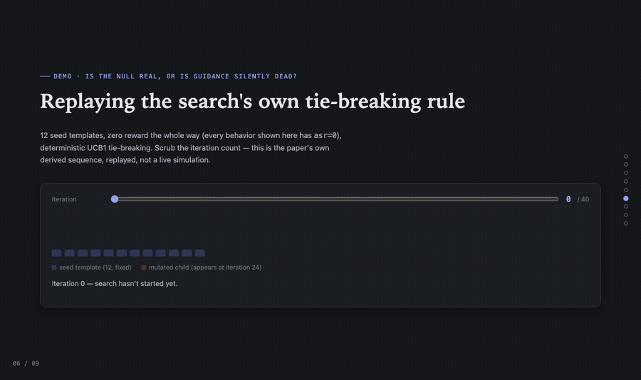

# jlens-fuzz

Interpretability-guided jailbreak fuzzing for open-weight LLMs. We tested whether mutating a
jailbreak template at the location a refusal direction (difference-in-means, extracted per
[Arditi et al. 2024](https://arxiv.org/abs/2406.11717)) points to beats GPTFuzzer's uniform
whole-template mutation. Along the way, our own pipeline caught its success judge lying to it —
that became the headline. **Two findings, both artifact-backed:**

1. **Judge reliability is a persistent, cross-judge problem, not one classifier's quirk.** The
   standard `hubert233/GPTFuzz` RoBERTa judge inflates ASR via template-echo false positives. We
   built a stricter two-stage replacement (keyword pre-filter + anti-roleplay LLM-as-judge
   rubric) — and it *still* passed a persona-wrapper completion that actually refuses and offers
   crisis-support resources, zero harmful content.
2. **Activation-guided mutation shows no consistent, reliable ASR advantage over uniform
   mutation**, on either of two targets tested (Qwen2.5-3B-Instruct, Phi-4-mini-instruct) — with
   the mechanism independently confirmed as genuinely active (attribution fires every iteration,
   search really does revisit mutated candidates), so the null isn't an artifact of the method
   quietly doing nothing. The likely explanation: the guidance signal's usefulness tracks how
   well the underlying refusal direction separates harmful from benign prompts, and that
   separation is strong on one target and weak on the other.

**Read the paper: [`paper/paper.tex`](paper/paper.tex)** (compiles to `paper/paper.pdf`; this is
the submission artifact) — or [`paper/paper.md`](paper/paper.md), the markdown source of record
it was derived from and numerically re-verified against. It states both findings precisely, with
every number traced to its source file, and is explicit about what's still a `DRAFT FLAG`
(unresolved provenance gaps, pending disclosure) — read that status before citing anything from
it.

## Demo — why the null isn't a dead mechanism



A null result only means something if the mechanism actually ran. This replays the search's own
UCB1 tie-breaking under zero reward: iterations 0–11 visit each of the 12 seed templates once,
12–23 revisit them, and at **iteration 24** a freshly mutated child — zero visits, same zero
reward, therefore a larger exploration bonus — starts winning selection. That transition point was
derived analytically in §5.3 *and* observed at exactly iteration 24 in two independent real runs on
two different targets. Guided mutation was genuinely engaged; it just didn't reliably help
(§5.2).

## Ethics

This is red-teaming research on public benchmarks (AdvBench) against small open-weight models,
done to study a measurement problem (judge reliability), not to produce a usable attack tool.

- **Policy: no jailbreak strings or harmful completions are published in this repository.**
  Raw template/candidate/completion text (including anything touching the self-harm category in
  AdvBench) is `.gitignore`d and never committed — only aggregate scalar metrics
  (`results/*.json`) are tracked. **A prior gap in this policy has been found and fixed**:
  `/review 7` (`reviews/stage7.md`) found `results/debug_attribution_*.log` — committed for
  §5.3's mechanism-quality evidence — contained verbatim fragments of AI-mutated
  jailbreak-template *framing* text (no actionable harmful payload, but still in-scope for this
  policy) that slipped past `.gitignore`'s filename-pattern matching. That text has since been
  redacted from both the logs and `paper/paper.md` §5.3 (individual tokens and scores kept,
  assembled span text removed), and `.gitignore` plus a new content-scanning check
  (`scripts/check_no_raw_text.py`, wired into `.github/workflows/ci.yml` and
  `.githooks/pre-commit`) now guard against a recurrence — see `reviews/stage7.md` for the full
  verification trail.
- Anyone needing to verify a specific claim must regenerate it themselves from the committed
  code, config, and public benchmark — this repo does not ship a copy of what was generated.
- Full policy: `PLAN.md` §8 and `paper/paper.md` §7 (Ethics and Responsible Disclosure).
  **Gate 7 is SIGNED OFF** (`reviews/stage7-human-signoff.md`, 2026-08-08; the FAIL verdict in
  `reviews/stage7.md` is the pre-sign-off historical record, not the current state).
  **This repo was made public on 2026-08-17** (Gate 8, Communicate) — ahead of the disclosure
  plan's original "at arXiv posting" trigger; see
  `reviews/disclosure-timing-decision-2026-08-17.md` for the recorded reasoning. **Disclosure
  notices to Microsoft (MSRC — Phi-4-mini-instruct, Phi-3.5-mini-instruct) and Alibaba/Qwen
  (Qwen2.5-3B-Instruct) have not yet been sent** and are now overdue relative to PLAN.md §8's
  "before publicizing" bar — this is a known, recorded gap, not an oversight.

## Reproduction

Everything runs on **Kaggle's free tier** (2×T4 GPUs/session) — no paid APIs, no local GPU
needed for the control-plane laptop side. Full click-by-click instructions: `RUNBOOK.md`. Short
version:

```bash
# On Kaggle, after cloning the repo and installing requirements.txt:
!python scripts/run_fuzz.py --method ours      --config configs/exp.yaml --smoke
!python scripts/run_fuzz.py --method gptfuzzer --config configs/exp.yaml --smoke
# swap --config configs/exp_phi4mini.yaml for the second target
```

`configs/exp.yaml` (Qwen2.5-3B, control) and `configs/exp_phi4mini.yaml` (Phi-4-mini, treatment)
hold every invariant (judge, benchmark, budget, decoding params) fixed except the target model —
required for cross-target ASR comparisons to mean anything (see `CLAUDE.md` rule 3).
`experiments.yaml` is the full job manifest; `python scripts/run_controller.py --lane core` shows
what's done/ready/blocked and prints the next Kaggle launch commands.

**Scale, stated plainly: every result in this repo is smoke-scale (`n=5` behaviors per
condition, single seed, no replicates).** The originally planned full evaluation — 25 behaviors ×
3 seeds × 2 targets — did not run; the free-tier compute budget was exhausted first. This is a
hard resource constraint, not a pending TODO — see `paper/paper.md` §4 and §6 for the full
accounting, and don't read the smoke-scale numbers as carrying more statistical weight than n=5
supports.

`scripts/make_figures.py` and `scripts/assemble_paper.py` (referenced by `experiments.yaml`'s
`figures`/`paper` jobs and the `Makefile`'s `figures`/`paper` targets) are **not implemented** —
`paper/paper.md` was assembled by hand directly from `results/*.json`, not generated by a script.
`make status` / `make job JOB=<id>` do work today; `make figures` / `make paper` do not yet.

## Provenance

Every number in `paper/paper.md` is cited to a specific file — `results/*.json` (aggregate
scalars, one file per run, each carrying a `_provenance` block with git SHA/config hash/
timestamp), `results/*.npz` (direction/probe extraction artifacts), or `results/*.log` (console
output committed verbatim, e.g. novel-prompt separation checks and debug-attribution traces).
Numbers the paper could *not* trace to a committed file are explicitly marked `[DRAFT FLAG]` or
"PI-reported, not yet artifact-backed" rather than presented as fact — see `paper/paper.md`
Appendix A for the full per-claim provenance table.

For the judge-reliability finding specifically, the full incident writeup — the original
false-positive discovery, the two-stage fix, and the residual false positive found *after* the
fix — is in **[`reviews/judge-validity-incident.md`](reviews/judge-validity-incident.md)**. For
the project's stage-by-stage history, peer-review gates, and every design decision (including
ones later reversed, documented rather than erased), see **[`PLAN.md`](PLAN.md)**.

## Repo map

```
paper/paper.tex, references.bib        the paper — submission artifact, compiles to paper.pdf
paper/paper.md                         markdown source of record paper.tex was derived from
CITATION.cff                           how to cite this repo/paper (GitHub "Cite this repository")
reviews/judge-validity-incident.md     full judge false-positive writeup
reviews/stage*.md                      peer-review gate records (/review N)
PLAN.md                                stage plan, gates, every design decision + reversal
RUNBOOK.md                             click-by-click: accounts, Kaggle, the daily loop
ORCHESTRATION.md                       pipeline coordination + script interfaces
CLAUDE.md                              rules this project's coding agent follows
configs/exp*.yaml                      per-target invariants (judge, budget, decoding params)
experiments.yaml                       job manifest (deps + output + command per job)
scripts/run_fuzz.py                    the core fuzzing loop (guided vs. uniform mutation)
scripts/judge.py                       the two-stage judge (shared across all consumers)
scripts/run_controller.py              resumable orchestrator (status board + next batch)
results/                               aggregate-only run outputs (raw prompts gitignored)
```

## License

No `LICENSE` file exists yet. Do not treat this repo as licensed for reuse until one is added.
